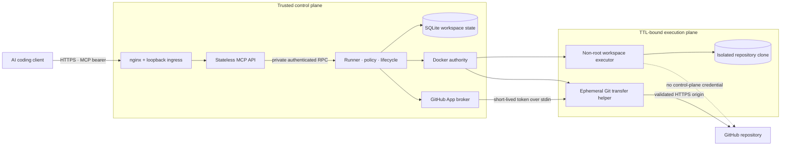
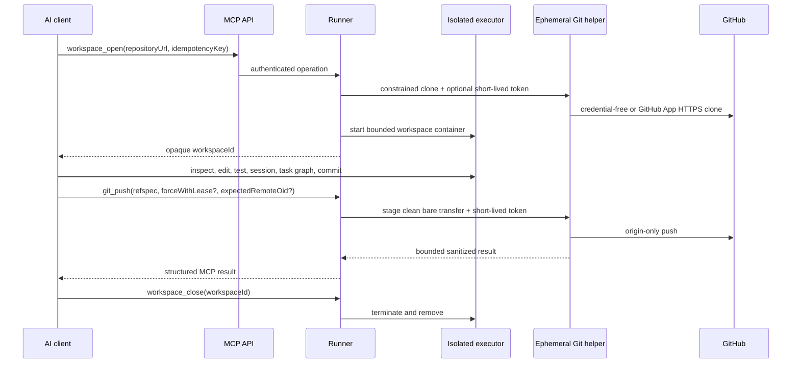

# Cloud Harness MCP


Cloud Harness MCP is an MIT-licensed remote coding harness exposed through
authenticated Streamable HTTP MCP. It opens an isolated clone in a
TTL-limited Docker executor and gives one trusted owner structured workspace,
file, code-intelligence, command, shell, session, dependency-task, Git,
worktree, skill, hook, memory, and repository-defined deployment tools.

> [!WARNING]
> This is a private, single-owner service. It is intentionally capable of
> arbitrary command execution inside an executor and is not a hostile
> multi-tenant sandbox. Read the [security model](docs/security-model.md)
> before operating it.

The public MCP URL is:

```text
https://cloud-harness-mcp.46-250-239-227.sslip.io/mcp
```

## Architecture

MCP is the northbound control protocol; the harness is the execution runtime.
The split keeps Internet-facing request handling away from Docker authority and
keeps repository credentials out of long-lived executors.



The source of truth for these boundaries is
[`compose.yaml`](compose.yaml),
[`apps/runner/src/workspace-service.ts`](apps/runner/src/workspace-service.ts),
and the [security model](docs/security-model.md).

## Coding workflow



Remote fetch, pull, and push use a sibling transfer repository that the
executor cannot see. Push requires a GitHub App installation with repository
write access; clone/fetch/pull need read access. See
[configuration](docs/configuration.md#optional-private-github-clone) and
[MCP semantics](docs/mcp-api.md).

## Connect from Codex

Keep the bearer token in the environment, not in `config.toml`:

```bash
export CLOUD_HARNESS_MCP_TOKEN="<owner-provided-token>"
```

Add this to `~/.codex/config.toml` (or a trusted project's
`.codex/config.toml`):

```toml
[mcp_servers.cloud_harness]
url = "https://cloud-harness-mcp.46-250-239-227.sslip.io/mcp"
bearer_token_env_var = "CLOUD_HARNESS_MCP_TOKEN"
required = true
tool_timeout_sec = 300
default_tools_approval_mode = "writes"
```

Restart Codex, then use `/mcp` or `codex mcp list` to confirm the connection.
The fields above follow the
[official OpenAI MCP configuration documentation](https://developers.openai.com/codex/mcp).
The `writes` policy prompts for tools not marked read-only; it does not make
the executor safe for untrusted users.

Start by asking Codex to call `workspace_open` with a credential-free HTTPS
repository URL and a new idempotency key. Reuse the returned opaque
`workspaceId` for later calls and finish with `workspace_close`. See
[MCP usage](docs/mcp-api.md) for the workflow and important semantics.

## Run locally

Prerequisites are Node.js 24+, npm, Docker Engine, and Docker Compose v2.

```bash
npm ci
cp .env.example .env
# Replace every change-me value in .env with an independent random secret.
docker compose --profile images build executor-image api runner
docker compose up -d runner api ingress
curl --fail http://127.0.0.1:3100/readyz
```

Local Compose publishes only a credential-free TCP ingress proxy on host
loopback. The API and runner remain on separate internal networks; only the
runner has Docker authority. Local Compose does not configure TLS. Stop it with:

```bash
docker compose down
```

## Documentation

- [System architecture](docs/system-architecture.md)
- [MCP usage and tool semantics](docs/mcp-api.md)
- [Configuration](docs/configuration.md)
- [Security model](docs/security-model.md)
- [Development and testing](docs/development.md)
- [Operations, backup, rollback, and cleanup](docs/operations.md)
- [VPS deployment with nginx and Certbot](docs/deployment.md)
- [Troubleshooting](docs/troubleshooting.md)

The repository is public at
[bestagentkits/cloud-harness-mcp](https://github.com/bestagentkits/cloud-harness-mcp)
and licensed under the [MIT License](LICENSE).
