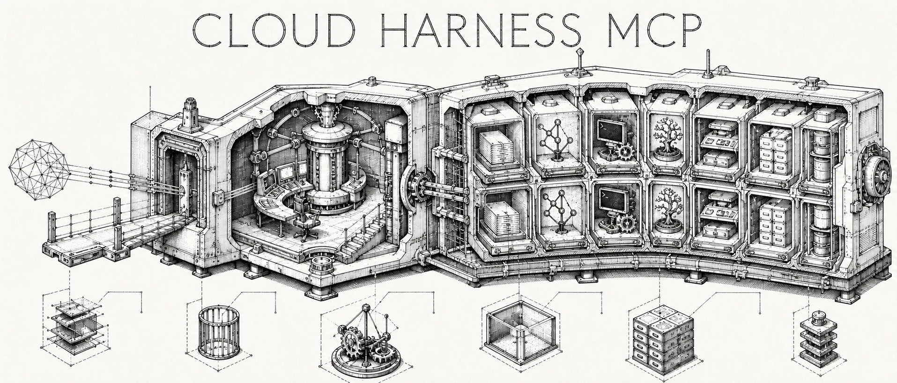
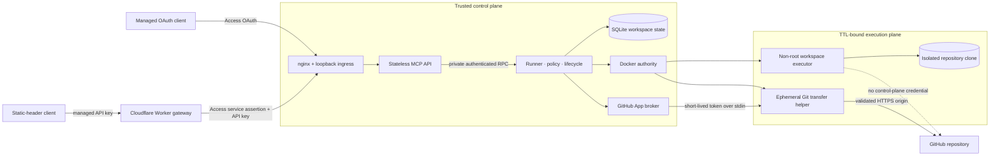
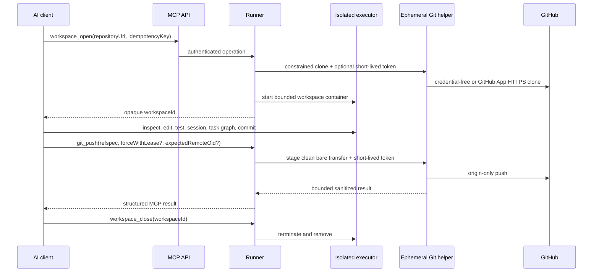

# Cloud Harness MCP



Cloud Harness MCP is an MIT-licensed remote coding harness exposed through
authenticated Streamable HTTP MCP. It opens an isolated clone in a
TTL-limited Docker executor and gives a trusted owner or named mutually trusted
operators structured workspace,
file, code-intelligence, command, shell, session, dependency-task, Git,
worktree, skill, hook, memory, and repository-defined deployment tools.

> [!WARNING]
> This is a private service for one security domain. Its operators must trust
> one another because it is intentionally capable of arbitrary command
> execution inside a shared-kernel executor. Principal isolation is not a
> hostile multi-tenant sandbox. Read the [security model](docs/security-model.md)
> before operating it.

The Managed OAuth MCP URL is:

```text
https://harness.zuey.me/mcp
```

Static-header clients use dashboard-managed API keys at the separate gateway:

```text
https://api.harness.zuey.me/mcp
```

## Architecture

MCP is the northbound control protocol; the harness is the execution runtime.
The split keeps Internet-facing request handling away from Docker authority and
keeps repository credentials out of long-lived executors.



The source of truth for these boundaries is
[`compose.yaml`](compose.yaml),
[`apps/runner/src/workspace-service.ts`](apps/runner/src/workspace-service.ts),
and the [security model](docs/security-model.md).

## Coding workflow



Remote fetch, pull, and push use a sibling transfer repository that the
executor cannot see. Push requires a GitHub App installation with repository
write access; clone/fetch/pull need read access. See
[configuration](docs/configuration.md#optional-github-app-repository-access) and
[MCP semantics](docs/mcp-api.md).

## Getting started

1. Read the [security model](docs/security-model.md), then configure one of the
   supported clients below with the owner token kept in local private
   configuration.
2. Ask the client to call `workspace_open` with a credential-free HTTPS
   repository URL and a fresh idempotency key. Keep the returned opaque
   `workspaceId`; do not derive it from a path or repository name.
3. Use the bounded tools in the existing workspace, then close shells,
   sessions, and unwanted tasks before calling `workspace_close`.

Start with the normal workflow in [MCP usage](docs/mcp-api.md#normal-workflow)
for lifecycle, cursor, network, and Git-transfer semantics.

## Local stdio workspace mode

In addition to the remote HTTP/Docker service, Cloud Harness MCP can operate directly against an explicitly selected project folder on your local machine over **stdio transport**.

```bash
# Start local stdio server for a project:
cloud-harness-mcp --transport stdio --workspace /path/to/project
```

In local mode:

- The configured folder behaves as an already-opened workspace (with an opaque `workspaceId`). `workspace_open` is not required.
- File operations, patches, grep search, symbol search, sessions, tasks, and local Git tools operate directly on the folder.
- `workspace_close` terminates owned child processes and tasks but **never deletes your local project folder**.
- Tool paths and working directories are strictly confined within the workspace root.
- Commands (`exec_run`, shells, tasks) execute with host-user permissions. File path confinement is not an OS sandbox.
- Network Git (`git_fetch`, `git_pull`) and Git push (`git_push`) are disabled by default and require explicit startup opt-in flags (`--git-network`, `--git-push`).
- v1 supports POSIX (Linux and macOS); Windows process semantics are a documented follow-up (use WSL on Windows).

### CLI options

| Option | Description |
|---|---|
| `--transport <http\|stdio>` | Select transport protocol: `http` (default) or `stdio` |
| `--workspace <path>` | Absolute path to the local project folder (required for stdio) |
| `--git-network` | Enable network Git operations (`git_fetch`, `git_pull`) |
| `--git-push` | Enable Git push (`git_push`, implies `--git-network`) |
| `--env <NAME>` | Forward additional host environment variable (repeatable) |
| `-h, --help` | Display help message |
| `-v, --version` | Display version information |

### Configuring local stdio in AI clients

#### Claude Desktop

In `~/Library/Application Support/Claude/claude_desktop_config.json` (macOS) or `~/.config/Claude/claude_desktop_config.json` (Linux):

```json
{
  "mcpServers": {
    "cloud-harness-local": {
      "command": "node",
      "args": [
        "/path/to/cloud-harness-mcp/apps/api/dist/index.js",
        "--transport",
        "stdio",
        "--workspace",
        "/path/to/my-project"
      ]
    }
  }
}
```

#### Claude Code

```bash
claude mcp add cloud-harness-local --transport stdio -- node /path/to/cloud-harness-mcp/apps/api/dist/index.js --transport stdio --workspace /path/to/my-project
```

#### Cursor

In `.cursor/mcp.json`:

```json
{
  "mcpServers": {
    "cloud-harness-local": {
      "command": "node",
      "args": [
        "/path/to/cloud-harness-mcp/apps/api/dist/index.js",
        "--transport",
        "stdio",
        "--workspace",
        "/path/to/my-project"
      ]
    }
  }
}
```

#### OpenAI Codex

In `~/.codex/config.toml`:

```toml
[mcp_servers.cloud_harness_local]
command = "node"
args = ["/path/to/cloud-harness-mcp/apps/api/dist/index.js", "--transport", "stdio", "--workspace", "/path/to/my-project"]
```

## MCP tools

The public tool names are owned by
[`RunnerOperationSchema`](packages/contracts/src/runner-api.ts). Inputs,
bounds, and approval annotations are owned by
[`TOOL_SPECS`](packages/contracts/src/tool-schemas.ts); the API registers each
of those specs in [`mcp-server.ts`](apps/api/src/mcp-server.ts).

### Workspace lifecycle

`workspace_open`, `workspace_list`, `workspace_status`, `workspace_close`

### Files and code intelligence

`files_list`, `files_read`, `files_write`, `files_apply_patch`, `files_delete`,
`files_move`, `files_mkdir`, `grep_search`, `symbols_search`,
`symbols_references`

### Commands, shells, sessions, and tasks

`exec_run`, `shell_open`, `shell_io`, `shell_close`, `sessions_list`,
`sessions_open`, `sessions_io`, `sessions_close`, `tasks_list`, `tasks_run`,
`tasks_status`, `tasks_cancel`, `tasks_graph`

### Git and worktrees

`git_status`, `git_diff`, `git_log`, `git_branch`, `git_checkout`, `git_add`,
`git_commit`, `git_fetch`, `git_pull`, `git_push`, `git_merge`, `git_rebase`,
`worktrees_list`, `worktrees_create`, `worktrees_remove`

### Repository extensions

`skills_list`, `skills_read`, `skills_run`, `hooks_list`, `hooks_run`,
`memories_list`, `memories_read`, `memories_write`, `deployments_list`,
`deployments_run`

## Install the Cloud Harness skill

Install the self-contained `cloudharness` operating skill directly from this
repository with the [skills CLI](https://www.npmjs.com/package/skills):

```bash
npx skills add bestagentkits/cloud-harness-mcp --skill cloudharness
```

Use `--global` to install it for the current user instead of the current
project. The skill includes detailed, portable references for every public
operation, input bound, side effect, recovery path, and security boundary. It
does not install credentials or connect the MCP endpoint; complete one of the
client configurations below separately.

This repository also publishes the same skill as a plugin package for both
Claude Code and OpenAI's plugin format.

<details>
<summary>Install from the Claude Code marketplace</summary>

```bash
claude plugin marketplace add bestagentkits/cloud-harness-mcp
claude plugin install cloud-harness@bestagentkits
```

The package is skills-only, so register the authenticated MCP connection under
**Claude Code** below after installation. See Anthropic's
[plugin marketplace guide](https://code.claude.com/docs/en/plugin-marketplaces)
for update and uninstall commands.

</details>

<details>
<summary>Install from the OpenAI plugin marketplace</summary>

Once this repository has been added to an available OpenAI marketplace, install
the package with:

```bash
codex plugin marketplace add bestagentkits/cloud-harness-mcp
codex plugin add cloud-harness@bestagentkits
```

The OpenAI package contains the portable skill, store metadata, logo, privacy
policy, and terms. It intentionally does not embed an app registration ID,
bearer token, or MCP authorization. OpenAI reviews skills-only and MCP-only
plugins, but a public authenticated remote MCP listing requires a supported
OAuth flow. The owner deployment uses Cloudflare Access Managed OAuth; the
package itself still embeds no deployment-specific authorization or app
registration.
See OpenAI's [plugin packaging](https://developers.openai.com/plugins/build/plugins),
[submission](https://developers.openai.com/plugins/deploy/submission), and
[authentication](https://developers.openai.com/plugins/build/auth) guidance.

</details>

## Connect from AI clients

The owner deployment exposes two remote Streamable HTTP MCP lanes:

```text
Managed OAuth: https://harness.zuey.me/mcp
Static API key: https://api.harness.zuey.me/mcp
```

The owner deployment uses `cloudflare-access`: Managed OAuth clients connect to
the first URL and complete GitHub or Google login in the browser. Static-header
clients use only the second URL with `Authorization: Bearer <dashboard-api-key>`.
Its dashboard is `https://harness.zuey.me/dashboard`.

Create, list, and revoke API keys under **Dashboard → API keys**. A new key is
shown once and cannot be recovered; store it only in the client's private
credential store. Keys expire after 1–3,650 days (approximately 10 years), and each identity may have at
most 10 active keys. There are no per-tool scopes or rotation endpoint: replace
a key by creating a new one and then revoking the old one. Every key has the
creator's full MCP authority, including arbitrary command execution in the
executor. Revocation or expiry denies the next request.

The API-key gateway is not an alternate dashboard login and does not accept
Managed OAuth. Conversely, `https://harness.zuey.me/mcp` does not accept a
dashboard-managed API key. See the [security model](docs/security-model.md) for
the independent Worker/Access/key checks.

`owner-bearer` remains the software default for separate private deployments.
The direct-header examples below use `CLOUD_HARNESS_MCP_TOKEN`. For this owner
deployment, set it to a dashboard-managed key and use
`https://api.harness.zuey.me/mcp`. For a separate `owner-bearer` deployment,
use the owner-provided token and `https://<owner-bearer-hostname>/mcp`. Keep the
credential and URL in client-local private configuration; never put the token
in a repository, prompt, or shared project configuration.

Other operators may deploy `cloudflare-access` on an eligible hostname in an
owned Cloudflare zone. Access provides Managed OAuth and GitHub/Google SSO;
Cloud Harness verifies the forwarded assertion and exposes the dashboard at
`/dashboard`. Treat client login as supported only after the exact client,
Access policy, discovery, refresh, and revocation flow has been verified live.
Implementation, merge, and Cloudflare configuration are separate evidence
states. See [configuration](docs/configuration.md#authentication-and-request-policy)
and [deployment](docs/deployment.md#cloudflare-access-rollout).

Granting either form of access grants remote execution authority. Read the
[security model](docs/security-model.md) before connecting it.

<details>
<summary>ChatGPT</summary>

ChatGPT custom MCP apps are configured in the web app and must be reachable
from OpenAI's infrastructure. Enable Developer mode, then go to **Settings or
Workspace settings → Apps → Create**, enter the endpoint above, scan its tools,
and create the app. The exact availability and controls depend on the ChatGPT
plan and workspace role; follow [OpenAI's current Developer mode guide](https://help.openai.com/en/articles/12584461-developer-mode-and-full-mcp-connectors-in-chatgpt).

The `owner-bearer` mode is not a documented direct path because the custom-app
flow has no arbitrary-header field. In `cloudflare-access` mode, use the
owner-controlled Access URL and complete its OAuth flow; keep the connection
provisional until the live compatibility checklist passes. Never place the
owner bearer in an app definition or a chat.

</details>

<details>
<summary>Codex</summary>

Set the token in your shell before starting Codex:

```bash
export CLOUD_HARNESS_MCP_TOKEN="<owner-provided-token>"
```

On PowerShell, use:

```powershell
$env:CLOUD_HARNESS_MCP_TOKEN = "<owner-provided-token>"
```

Add this to `~/.codex/config.toml` (or a trusted project's
`.codex/config.toml`):

```toml
[mcp_servers.cloud_harness]
url = "https://<owner-bearer-hostname>/mcp"
bearer_token_env_var = "CLOUD_HARNESS_MCP_TOKEN"
required = true
tool_timeout_sec = 300
default_tools_approval_mode = "writes"
```

Restart Codex, then use `/mcp` or `codex mcp list` to confirm the connection.
The fields follow the [Codex MCP configuration documentation](https://developers.openai.com/codex/mcp).

</details>

<details>
<summary>Claude Desktop app</summary>

Claude's remote custom connectors are set up from the Claude app and are called
from Anthropic's cloud, rather than from your computer. In **Settings →
Connectors**, add the public endpoint and complete the connector's supported
authentication flow. The current workflow and plan availability are documented
by [Anthropic](https://support.claude.com/en/articles/11175166-get-started-with-custom-connectors-using-remote-mcp).

The hosted connector flow is OAuth-oriented and has no documented
static-header field. Use `cloudflare-access` and complete its OAuth flow for a
hosted connector, subject to live compatibility verification, or use Claude
Code below with the default owner bearer.

</details>

<details>
<summary>Claude Code</summary>

Set the token, then register the server for your user account:

```bash
export CLOUD_HARNESS_MCP_TOKEN="<owner-provided-token>"
claude mcp add --transport http --scope user \
  --header "Authorization: Bearer $CLOUD_HARNESS_MCP_TOKEN" \
  cloud-harness https://<owner-bearer-hostname>/mcp
```

Use `claude mcp get cloud-harness` to inspect the entry, then `/mcp` in a
Claude Code session to confirm that it is available. Claude Code documents
remote HTTP registration and static headers in its [MCP guide](https://code.claude.com/docs/en/mcp).

</details>

<details>
<summary>Gemini CLI</summary>

Set the token, then add a remote HTTP MCP server:

```bash
export CLOUD_HARNESS_MCP_TOKEN="<owner-provided-token>"
gemini mcp add --transport http \
  --header "Authorization: Bearer $CLOUD_HARNESS_MCP_TOKEN" \
  cloud-harness https://<owner-bearer-hostname>/mcp
```

Restart Gemini CLI if it is already running and use its MCP management command
to confirm the server. See the [Gemini CLI MCP-server reference](https://github.com/google-gemini/gemini-cli/blob/main/docs/tools/mcp-server.md)
for the supported transports and header syntax.

</details>

<details>
<summary>Cursor</summary>

Open **Customize → MCP** and add a remote Streamable HTTP server, or add the
following to the global `~/.cursor/mcp.json` (use `.cursor/mcp.json` for a
trusted project only):

```json
{
  "mcpServers": {
    "cloud-harness": {
      "url": "https://<owner-bearer-hostname>/mcp",
      "headers": {
        "Authorization": "Bearer ${env:CLOUD_HARNESS_MCP_TOKEN}"
      }
    }
  }
}
```

Restart Cursor, approve the server, and check that `cloud-harness` appears in
the chat's available tools. Cursor documents the configuration locations and
remote MCP support in its [MCP guide](https://cursor.com/docs/mcp).
The global file is user-local; do not copy the token-bearing project file into
source control.

</details>

<details>
<summary>Google Antigravity</summary>

In the agent side panel, choose **… → MCP Servers → Manage MCP Servers → View
raw config**. This opens the global `~/.gemini/config/mcp_config.json`; add a
remote server entry:

```json
{
  "mcpServers": {
    "cloud-harness": {
      "serverUrl": "https://<owner-bearer-hostname>/mcp",
      "headers": {
        "Authorization": "Bearer <owner-provided-token>"
      }
    }
  }
}
```

Save the file and confirm that the server is enabled in the MCP Servers panel.
Antigravity's [MCP reference](https://antigravity.google/docs/mcp) defines the
global path, `serverUrl`, and `headers` for remote MCP servers. Keep this local
configuration private.

</details>

<details>
<summary>Grok</summary>

In Grok web, open the **+** menu, choose **Connectors**, then select **Add
connector** to create a custom MCP connection. It must use a public URL; see
xAI's [connector overview](https://x.ai/news/grok-connectors). The consumer
connector UI may require an OAuth flow, so use the Access-mode endpoint and
verify that flow live. It is not a documented direct path for owner-bearer
mode.

For the xAI API, Remote MCP Tools support an explicit authorization token. Add
this object to a Responses API request's `tools` array:

```json
{
  "type": "mcp",
  "server_url": "https://<owner-bearer-hostname>/mcp",
  "server_label": "cloud-harness",
  "authorization": "Bearer <owner-provided-token>"
}
```

Limit `allowed_tools` when the request needs only a subset. The [xAI Remote MCP
Tools reference](https://docs.x.ai/developers/tools/remote-mcp) documents
Streamable HTTP support, authorization, and tool allowlisting.

</details>

Start by asking a connected client to call `workspace_open` with a
credential-free HTTPS repository URL and a new idempotency key. Reuse the
returned opaque `workspaceId` for later calls and finish with
`workspace_close`. See [MCP usage](docs/mcp-api.md) for the workflow and
important semantics.

## Run locally

Prerequisites are Node.js 24+, npm, Docker Engine, and Docker Compose v2.

```bash
npm ci
cp .env.example .env
# Replace every change-me value in .env with an independent random secret.
docker compose --profile images build executor-image api runner
docker compose up -d runner api ingress
curl --fail http://127.0.0.1:3100/readyz
```

Local Compose publishes only a credential-free TCP ingress proxy on host
loopback. The API and runner remain on separate internal networks; only the
runner has Docker authority. Local Compose does not configure TLS. Stop it with:

```bash
docker compose down
```

## Configure environment variables

The local setup command above creates an ignored runtime environment file from
the maintained template. Generate two independent secrets, then replace the
two placeholder values in that runtime file:

```bash
openssl rand -hex 32 # MCP_BEARER_TOKEN
openssl rand -hex 32 # RUNNER_TOKEN
```

Both tokens must contain 32–512 characters. Never commit the runtime file or
paste either value into prompts, logs, or shared project configuration.
When a direct secret and its `_FILE` alternative are both set, the file value
takes precedence.

The server-side `MCP_BEARER_TOKEN` is the owner credential accepted by `/mcp`.
The client examples above store that same value under the client-local name
`CLOUD_HARNESS_MCP_TOKEN`. `RUNNER_TOKEN` is a separate, internal API-to-runner
credential and must never be given to an MCP client.

### Required and common settings

The values below are runtime defaults when a variable is omitted. The
maintained template may prefill the current public host and browser origin;
replace those entries with the hostname and origins of your deployment.

| Variable | Runtime default | Description |
|---|---:|---|
| `MCP_BEARER_TOKEN` | required | Owner bearer token for MCP requests. Use `MCP_BEARER_TOKEN_FILE` instead when a secret is mounted as a file. |
| `RUNNER_TOKEN` | required | Independent service token used only between the API and runner. `RUNNER_TOKEN_FILE` is also supported. |
| `OWNER_ID` | `owner` | Stable identifier attached to the single owner's workspaces. Changing it does not add multi-user isolation. |
| `API_PUBLIC_HOSTS` | `localhost,127.0.0.1` | Comma-separated `Host` allowlist. Add the public MCP hostname in a deployed environment. |
| `API_ALLOWED_ORIGINS` | empty | Comma-separated exact browser origins allowed to send requests. CLI clients that omit `Origin` do not need an entry. |
| `ALLOWED_GIT_HOSTS` | `github.com` | Comma-separated repository-host allowlist. Repository URLs must still use credential-free HTTPS. |
| `WORKSPACE_NETWORK_MODE` | `none` | Executor networking: `none` is the safe default; `bridge` explicitly allows ordinary container egress. |
| `WORKSPACE_WALL_TTL_SECONDS` | `900` | Maximum workspace lifetime, from 60 to 86,400 seconds. |
| `WORKSPACE_IDLE_TTL_SECONDS` | `300` | Maximum idle time, from 30 to 43,200 seconds. |
| `JOBS_ROOT` | `/var/lib/cloud-harness/jobs` | Runner path for ephemeral workspace directories. |
| `STATE_DB` | `/var/lib/cloud-harness/state/cloud-harness.db` | Runner SQLite state-file path. |
| `EXECUTOR_IMAGE` | `cloud-harness-executor:local` | Trusted executor image selected by the operator, never by MCP callers. |

The maintained template contains every setting needed for the normal local
Compose workflow. The following limits are optional; omit them to use their
validated defaults.

### Resource and request limits

| Variable | Default | Allowed value / purpose |
|---|---:|---|
| `REQUEST_TIMEOUT_MS` | `60000` | API-to-runner timeout; 1,000–300,000 ms. Keep client tool timeouts at least this long. |
| `MAX_BODY_BYTES` | `1048576` | Maximum API JSON request size; 1,024–4,194,304 bytes. |
| `MAX_OUTPUT_BYTES` | `262144` | Maximum bounded runner/worker result; 1,024–10,485,760 bytes. |
| `MIN_FREE_BYTES` | `2147483648` | Minimum free host storage required to admit a workspace; at least 104,857,600 bytes. |
| `MAX_WORKSPACE_BYTES` | `2147483648` | Soft workspace-size ceiling; at least 104,857,600 bytes. This is checked periodically, not enforced as a filesystem quota. |
| `REAPER_INTERVAL_SECONDS` | `30` | Interval for lifecycle and storage cleanup checks; 10–3,600 seconds. |
| `LOG_LEVEL` | `info` | Pino log level for API and runner processes, such as `debug`, `info`, `warn`, or `error`. |

### Optional private GitHub repositories

Public repositories need no additional credential. For private clone, fetch,
pull, or push, configure all three GitHub App values together:

| Variable | Description |
|---|---|
| `GITHUB_APP_ID` | Numeric GitHub App ID. |
| `GITHUB_APP_INSTALLATION_ID` | Numeric installation ID with access to the target repository. |
| `GITHUB_APP_PRIVATE_KEY_FILE` | Preferred path to the mounted PEM private key. Use `GITHUB_APP_PRIVATE_KEY` only when a file mount is unavailable. |

The App needs Contents read permission for clone, fetch, and pull; push needs
Contents read and write. Production Compose mounts the root-owned host
directory `/etc/cloud-harness-mcp` read-only at `/run/cloud-harness-secrets`,
so the maintained container path is
`/run/cloud-harness-secrets/github-app-private-key.pem`. Prefer the file form
instead of placing a private key directly in an environment variable. Follow
the [private GitHub repository setup guide](docs/github-app-private-repositories.md)
for App creation, least-privilege permissions, installation, key handling,
verification, troubleshooting, and rotation.

### Compose overrides

| Variable | Default | Description |
|---|---:|---|
| `CLOUD_HARNESS_ENV_FILE` | local runtime file | Selects the Compose environment file. Production defaults to `/etc/cloud-harness-mcp/runtime.env`. |
| `API_HOST_PORT` | `3100` | Loopback host port published by the credential-free ingress proxy. |
| `HOST_JOBS_ROOT` | `/var/lib/cloud-harness/jobs` | Host directory mounted for workspace data. |
| `HOST_STATE_ROOT` | `/var/lib/cloud-harness/state` | Host directory mounted for persistent runner state. |

Compose fixes `API_HOST=0.0.0.0`, `API_PORT=3000`,
`RUNNER_HOST=0.0.0.0`, `RUNNER_PORT=3001`, and
`RUNNER_URL=http://runner:3001` on its private networks. Those variables are
available when starting the Node.js processes directly, but changing them in
the Compose runtime file has no effect because the service definition owns the
wiring. Keep the API and runner private and publish only the loopback ingress.

For production file ownership, key mounts, and TLS setup, use the
[deployment guide](docs/deployment.md). Exact validation rules and defaults
remain owned by [`packages/contracts/src/config.ts`](packages/contracts/src/config.ts),
with operational rationale in the [configuration guide](docs/configuration.md).

## Documentation

- [Installable cloudharness operating skill](.agents/skills/cloudharness/SKILL.md)
- [Cloud Harness support](https://cloud-harness-mcp.pages.dev/support.html)
- [Privacy policy](https://cloud-harness-mcp.pages.dev/privacy.html) and
  [terms of service](https://cloud-harness-mcp.pages.dev/terms.html)
- [System architecture](docs/system-architecture.md)
- [MCP usage and tool semantics](docs/mcp-api.md)
- [Configuration](docs/configuration.md)
- [GitHub App setup for private repositories](docs/github-app-private-repositories.md)
- [Security model](docs/security-model.md)
- [Development and testing](docs/development.md)
- [Operations, backup, rollback, and cleanup](docs/operations.md)
- [VPS deployment with nginx and Certbot](docs/deployment.md)
- [Cloudflare Pages landing page](docs/cloudflare-pages.md)
- [Troubleshooting](docs/troubleshooting.md)

The repository is public at
[bestagentkits/cloud-harness-mcp](https://github.com/bestagentkits/cloud-harness-mcp)
and licensed under the [MIT License](LICENSE).
