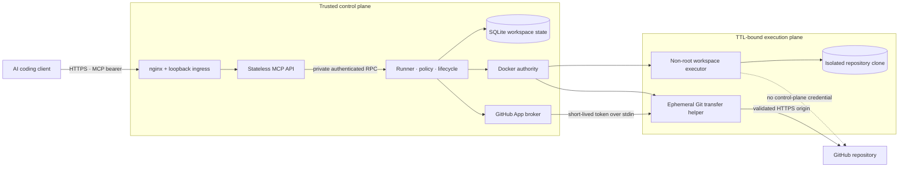
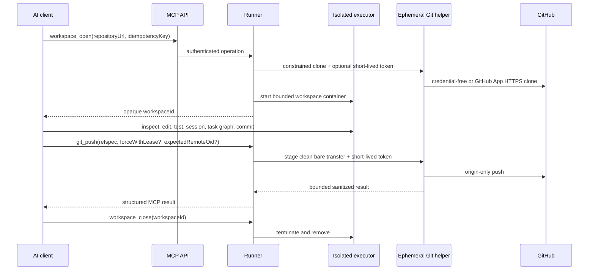

# Cloud Harness MCP


Cloud Harness MCP is an MIT-licensed remote coding harness exposed through
authenticated Streamable HTTP MCP. It opens an isolated clone in a
TTL-limited Docker executor and gives one trusted owner structured workspace,
file, code-intelligence, command, shell, session, dependency-task, Git,
worktree, skill, hook, memory, and repository-defined deployment tools.

> [!WARNING]
> This is a private, single-owner service. It is intentionally capable of
> arbitrary command execution inside an executor and is not a hostile
> multi-tenant sandbox. Read the [security model](docs/security-model.md)
> before operating it.

The public MCP URL is:

```text
https://cloud-harness-mcp.46-250-239-227.sslip.io/mcp
```

## Architecture

MCP is the northbound control protocol; the harness is the execution runtime.
The split keeps Internet-facing request handling away from Docker authority and
keeps repository credentials out of long-lived executors.



The source of truth for these boundaries is
[`compose.yaml`](compose.yaml),
[`apps/runner/src/workspace-service.ts`](apps/runner/src/workspace-service.ts),
and the [security model](docs/security-model.md).

## Coding workflow



Remote fetch, pull, and push use a sibling transfer repository that the
executor cannot see. Push requires a GitHub App installation with repository
write access; clone/fetch/pull need read access. See
[configuration](docs/configuration.md#optional-private-github-clone) and
[MCP semantics](docs/mcp-api.md).

## Getting started

1. Read the [security model](docs/security-model.md), then configure one of the
   supported clients below with the owner token kept in local private
   configuration.
2. Ask the client to call `workspace_open` with a credential-free HTTPS
   repository URL and a fresh idempotency key. Keep the returned opaque
   `workspaceId`; do not derive it from a path or repository name.
3. Use the bounded tools in the existing workspace, then close shells,
   sessions, and unwanted tasks before calling `workspace_close`.

Start with the normal workflow in [MCP usage](docs/mcp-api.md#normal-workflow)
for lifecycle, cursor, network, and Git-transfer semantics.

## MCP tools

The public tool names are owned by
[`RunnerOperationSchema`](packages/contracts/src/runner-api.ts). Inputs,
bounds, and approval annotations are owned by
[`TOOL_SPECS`](packages/contracts/src/tool-schemas.ts); the API registers each
of those specs in [`mcp-server.ts`](apps/api/src/mcp-server.ts).

### Workspace lifecycle

`workspace_open`, `workspace_list`, `workspace_status`, `workspace_close`

### Files and code intelligence

`files_list`, `files_read`, `files_write`, `files_apply_patch`, `files_delete`,
`files_move`, `files_mkdir`, `grep_search`, `symbols_search`,
`symbols_references`

### Commands, shells, sessions, and tasks

`exec_run`, `shell_open`, `shell_io`, `shell_close`, `sessions_list`,
`sessions_open`, `sessions_io`, `sessions_close`, `tasks_list`, `tasks_run`,
`tasks_status`, `tasks_cancel`, `tasks_graph`

### Git and worktrees

`git_status`, `git_diff`, `git_log`, `git_branch`, `git_checkout`, `git_add`,
`git_commit`, `git_fetch`, `git_pull`, `git_push`, `git_merge`, `git_rebase`,
`worktrees_list`, `worktrees_create`, `worktrees_remove`

### Repository extensions

`skills_list`, `skills_read`, `skills_run`, `hooks_list`, `hooks_run`,
`memories_list`, `memories_read`, `memories_write`, `deployments_list`,
`deployments_run`

## Connect from AI clients

This server exposes a remote Streamable HTTP MCP endpoint:

```text
https://cloud-harness-mcp.46-250-239-227.sslip.io/mcp
```

All direct integrations below use the owner-provided `CLOUD_HARNESS_MCP_TOKEN`.
Keep it in a local environment variable or client-local configuration; never
put it in a repository, prompt, or shared project configuration. This is a
single-owner execution service: granting a client access grants it the ability
to ask the executor to run commands. Read the [security model](docs/security-model.md)
before connecting it.

<details>
<summary>ChatGPT</summary>

ChatGPT custom MCP apps are configured in the web app and must be reachable
from OpenAI's infrastructure. Enable Developer mode, then go to **Settings or
Workspace settings → Apps → Create**, enter the endpoint above, scan its tools,
and create the app. The exact availability and controls depend on the ChatGPT
plan and workspace role; follow [OpenAI's current Developer mode guide](https://help.openai.com/en/articles/12584461-developer-mode-and-full-mcp-connectors-in-chatgpt).

This deployment uses a static bearer token. ChatGPT's custom-app flow is
intended for supported authentication flows such as OAuth and does not provide
a documented place to supply an arbitrary `Authorization` header. Put an
OAuth-capable MCP gateway in front of the service before connecting it to
ChatGPT; do not place the owner bearer token in an app definition or a chat.

</details>

<details>
<summary>Codex</summary>

Set the token in your shell before starting Codex:

```bash
export CLOUD_HARNESS_MCP_TOKEN="<owner-provided-token>"
```

On PowerShell, use:

```powershell
$env:CLOUD_HARNESS_MCP_TOKEN = "<owner-provided-token>"
```

Add this to `~/.codex/config.toml` (or a trusted project's
`.codex/config.toml`):

```toml
[mcp_servers.cloud_harness]
url = "https://cloud-harness-mcp.46-250-239-227.sslip.io/mcp"
bearer_token_env_var = "CLOUD_HARNESS_MCP_TOKEN"
required = true
tool_timeout_sec = 300
default_tools_approval_mode = "writes"
```

Restart Codex, then use `/mcp` or `codex mcp list` to confirm the connection.
The fields follow the [Codex MCP configuration documentation](https://developers.openai.com/codex/mcp).

</details>

<details>
<summary>Claude Desktop app</summary>

Claude's remote custom connectors are set up from the Claude app and are called
from Anthropic's cloud, rather than from your computer. In **Settings →
Connectors**, add the public endpoint and complete the connector's supported
authentication flow. The current workflow and plan availability are documented
by [Anthropic](https://support.claude.com/en/articles/11175166-get-started-with-custom-connectors-using-remote-mcp).

The hosted connector flow is OAuth-oriented and has no documented static-header
field. Therefore this bearer-token deployment cannot be connected directly to
Claude Desktop. Use an OAuth-capable gateway in front of it, or use Claude Code
below, which supports a local `Authorization` header.

</details>

<details>
<summary>Claude Code</summary>

Set the token, then register the server for your user account:

```bash
export CLOUD_HARNESS_MCP_TOKEN="<owner-provided-token>"
claude mcp add --transport http --scope user \
  --header "Authorization: Bearer $CLOUD_HARNESS_MCP_TOKEN" \
  cloud-harness https://cloud-harness-mcp.46-250-239-227.sslip.io/mcp
```

Use `claude mcp get cloud-harness` to inspect the entry, then `/mcp` in a
Claude Code session to confirm that it is available. Claude Code documents
remote HTTP registration and static headers in its [MCP guide](https://code.claude.com/docs/en/mcp).

</details>

<details>
<summary>Gemini CLI</summary>

Set the token, then add a remote HTTP MCP server:

```bash
export CLOUD_HARNESS_MCP_TOKEN="<owner-provided-token>"
gemini mcp add --transport http \
  --header "Authorization: Bearer $CLOUD_HARNESS_MCP_TOKEN" \
  cloud-harness https://cloud-harness-mcp.46-250-239-227.sslip.io/mcp
```

Restart Gemini CLI if it is already running and use its MCP management command
to confirm the server. See the [Gemini CLI MCP-server reference](https://github.com/google-gemini/gemini-cli/blob/main/docs/tools/mcp-server.md)
for the supported transports and header syntax.

</details>

<details>
<summary>Cursor</summary>

Open **Customize → MCP** and add a remote Streamable HTTP server, or add the
following to the global `~/.cursor/mcp.json` (use `.cursor/mcp.json` for a
trusted project only):

```json
{
  "mcpServers": {
    "cloud-harness": {
      "url": "https://cloud-harness-mcp.46-250-239-227.sslip.io/mcp",
      "headers": {
        "Authorization": "Bearer ${env:CLOUD_HARNESS_MCP_TOKEN}"
      }
    }
  }
}
```

Restart Cursor, approve the server, and check that `cloud-harness` appears in
the chat's available tools. Cursor documents the configuration locations and
remote MCP support in its [MCP guide](https://cursor.com/docs/mcp).
The global file is user-local; do not copy the token-bearing project file into
source control.

</details>

<details>
<summary>Google Antigravity</summary>

In the agent side panel, choose **… → MCP Servers → Manage MCP Servers → View
raw config**. This opens the global `~/.gemini/config/mcp_config.json`; add a
remote server entry:

```json
{
  "mcpServers": {
    "cloud-harness": {
      "serverUrl": "https://cloud-harness-mcp.46-250-239-227.sslip.io/mcp",
      "headers": {
        "Authorization": "Bearer <owner-provided-token>"
      }
    }
  }
}
```

Save the file and confirm that the server is enabled in the MCP Servers panel.
Antigravity's [MCP reference](https://antigravity.google/docs/mcp) defines the
global path, `serverUrl`, and `headers` for remote MCP servers. Keep this local
configuration private.

</details>

<details>
<summary>Grok</summary>

In Grok web, open the **+** menu, choose **Connectors**, then select **Add
connector** to create a custom MCP connection. It must use a public URL; see
xAI's [connector overview](https://x.ai/news/grok-connectors). The consumer
connector UI may require an OAuth flow, so it is not a documented direct path
for this static bearer-token service.

For the xAI API, Remote MCP Tools support an explicit authorization token. Add
this object to a Responses API request's `tools` array:

```json
{
  "type": "mcp",
  "server_url": "https://cloud-harness-mcp.46-250-239-227.sslip.io/mcp",
  "server_label": "cloud-harness",
  "authorization": "Bearer <owner-provided-token>"
}
```

Limit `allowed_tools` when the request needs only a subset. The [xAI Remote MCP
Tools reference](https://docs.x.ai/developers/tools/remote-mcp) documents
Streamable HTTP support, authorization, and tool allowlisting.

</details>

Start by asking a connected client to call `workspace_open` with a
credential-free HTTPS repository URL and a new idempotency key. Reuse the
returned opaque `workspaceId` for later calls and finish with
`workspace_close`. See [MCP usage](docs/mcp-api.md) for the workflow and
important semantics.

## Run locally

Prerequisites are Node.js 24+, npm, Docker Engine, and Docker Compose v2.

```bash
npm ci
cp .env.example .env
# Replace every change-me value in .env with an independent random secret.
docker compose --profile images build executor-image api runner
docker compose up -d runner api ingress
curl --fail http://127.0.0.1:3100/readyz
```

Local Compose publishes only a credential-free TCP ingress proxy on host
loopback. The API and runner remain on separate internal networks; only the
runner has Docker authority. Local Compose does not configure TLS. Stop it with:

```bash
docker compose down
```

## Documentation

- [System architecture](docs/system-architecture.md)
- [MCP usage and tool semantics](docs/mcp-api.md)
- [Configuration](docs/configuration.md)
- [Security model](docs/security-model.md)
- [Development and testing](docs/development.md)
- [Operations, backup, rollback, and cleanup](docs/operations.md)
- [VPS deployment with nginx and Certbot](docs/deployment.md)
- [Cloudflare Pages landing page](docs/cloudflare-pages.md)
- [Troubleshooting](docs/troubleshooting.md)

The repository is public at
[bestagentkits/cloud-harness-mcp](https://github.com/bestagentkits/cloud-harness-mcp)
and licensed under the [MIT License](LICENSE).
