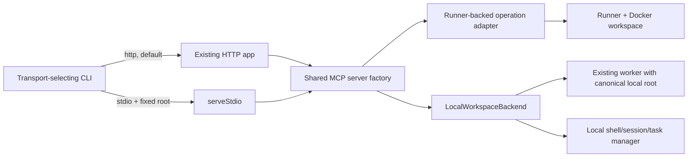

# Stdio transport and local-folder workspace

## Overview

Implement issue #33 as a second transport/execution mode: the deployed HTTP path remains API → runner → Docker, while a locally spawned stdio process operates on exactly one startup-selected folder. Keep `TOOL_SPECS` and result envelopes shared; make lifecycle and unsupported capabilities explicit instead of pretending local host execution has the remote sandbox.

Research: [findings](./research/research-findings.md) · [codebase scout](./reports/scout-report.md) · [red-team review](./reports/red-team-review.md)

## Scope

In scope:

- `cloud-harness-mcp --transport stdio --workspace <absolute-path>`.
- One implicit pre-opened local workspace with an opaque ID.
- Shared tool schemas, annotations, result envelopes, output bounds, and cursor semantics.
- Local file/search/symbol/exec/session/task/applicable Git/repository-extension tools.
- Path confinement, environment scrubbing, process-group cleanup, stdio protocol hygiene, tests, and user docs.
- Backward-compatible HTTP default and unchanged Compose/security topology.

Not in scope:

- Uploading or cloning the selected local folder.
- Claiming host execution is sandboxed.
- A containerized local executor, multi-root access, Windows process semantics, npm registry publication, or changes to deployed authentication.
- Local `github_action` support in v1; register the shared tool but return an explicit mode capability error.

## Proposed architecture

Key decisions awaiting review:

1. Local mode is implicit and pre-opened. `workspace_open` returns a clear mode error; list/status/close remain available.
2. Local `workspace_close` is terminal and idempotent: terminate owned processes, mark closed, never delete or rewrite the selected root.
3. POSIX (Linux/macOS) is the v1 target. Windows is a follow-up because process-group termination and `O_NOFOLLOW` differ.
4. Local network Git is opt-in; push requires a stronger explicit opt-in. Existing local checkout credentials are used only under that opt-in.
5. `privileged=true` and brokered `github_action` are unsupported in local v1 and return structured capability errors.
6. Commands run with host-user authority. Only tool paths and command working directories are confined; command contents can still access anything the user can.

## Cross-plan dependencies

No blocking overlap was found among pending plans. Coordinate documentation edits with `plans/260819-1652-cloud-harness-docs-site` and preserve the remote runner roadmap in `plans/260817-0848-2-cloud-harness-next-steps`; neither blocks this plan.

## Phases

| Phase | Name | Status | Depends on |
|---|---|---|---|
| 1 | [Shared operation boundary and transport CLI](./phase-01-shared-operation-boundary-and-transport-cli.md) | Pending | None |
| 2 | [Local lifecycle and filesystem confinement](./phase-02-local-lifecycle-and-filesystem-confinement.md) | Pending | Phase 1 |
| 3 | [Local processes, Git, and repository extensions](./phase-03-local-processes-git-and-repository-extensions.md) | Pending | Phase 2 |
| 4 | [Interop tests, documentation, and release readiness](./phase-04-interop-tests-documentation-and-release-readiness.md) | Pending | Phases 1-3 |

## Acceptance criteria

- [ ] `cloud-harness-mcp --transport stdio --workspace <absolute-path>` starts a protocol-clean stdio server.
- [ ] HTTP remains the default and existing HTTP, Compose, auth, runner, broker, and Docker behavior is unchanged.
- [ ] The local root is canonicalized once; file operations and command `cwd` reject absolute paths, traversal, and symlink escape.
- [ ] The selected folder is never cloned, uploaded, or deleted by close/shutdown.
- [ ] File, patch, search, symbol, exec, shell, session, task, applicable Git, worktree, skill, hook, memory, and deployment behavior uses shared schemas and bounded results.
- [ ] Non-Git folders keep non-Git tools usable and return structured errors for Git tools.
- [ ] Local subprocesses receive a curated environment, are tracked by PID/process group, and are terminated on close, cancellation, signal, and normal shutdown.
- [ ] stdout contains only MCP frames; all diagnostics use stderr.
- [ ] Local capability differences are explicit in instructions/status/errors.
- [ ] Tests cover startup, modern/legacy MCP negotiation, traversal, symlink escape/swap, spaces, non-Git roots, environment scrubbing, output bounds, cleanup, and close-without-delete.
- [ ] `npm run verify` passes; Docker/E2E gates run when their prerequisites are available.
- [ ] README, internal docs, and docs-site pages document Claude Code/Desktop, Cursor, and Codex stdio setup and distinguish host permissions from Docker isolation.

## Validation log

- Tier: Standard (4 phases).
- Verified repository claims: 14.
- Failed claims: 0.
- Deliberately unresolved platform claim: Windows process-group cleanup; deferred from v1.
- Consistency sweep: plan and all phase files must retain the same implicit-workspace, POSIX-v1, opt-in-network-Git, unsupported-capability, and no-delete decisions before implementation begins.
