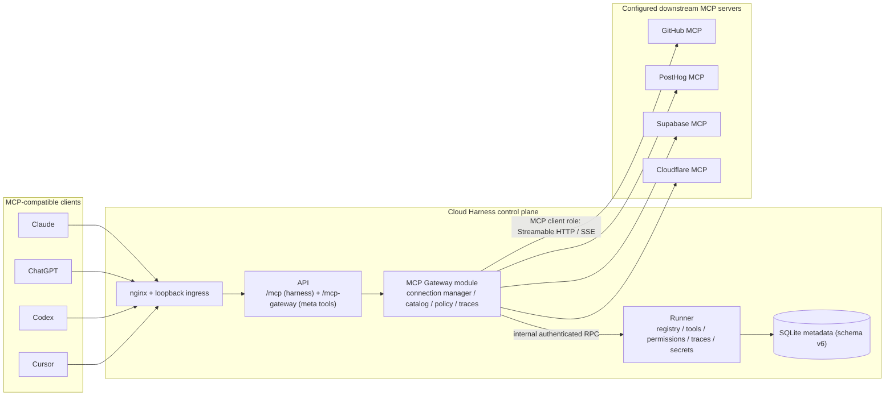

# Plan: MCP Gateway — one MCP endpoint that manages every configured MCP server

**Status:** Completed
**Date:** 2026-09-14
**Slug:** `260914-0414-mcp-gateway`
**Route:** feature
**Mode:** `/ak:vibe --advice --ship` (stable target `main`)

## Executive Summary

Today a user must register every third-party MCP server (GitHub, PostHog, Supabase,
Cloudflare, …) separately in Claude, ChatGPT, Codex, and Cursor. Cloud Harness already
has every primitive needed to become the control plane for those servers: an
authenticated Streamable HTTP MCP server (`apps/api/src/mcp-server.ts`), a principal
model (`RunnerPrincipalSelector`), encrypted global secrets in runner-owned SQLite, a
dashboard BFF, and structured logging.

This plan adds a **second MCP composition root** at `/mcp-gateway` that exposes a
**constant-size meta-tool surface** — `search`, `inspect`, `execute`, `permissions`,
`status` — instead of aggregating hundreds of downstream tools into `tools/list`.
Downstream tools stay in a principal-scoped registry and are disclosed progressively:
`search` finds a qualified name, `inspect` returns that one tool's real JSON Schema,
`execute` routes one call.

**Public-surface decision (owner-confirmed).** The existing `/mcp` endpoint is the
coding harness with ~60 native tools that current clients, skills, contract tests, and
`docs/mcp-api.md` depend on. Replacing it would be an unrelated regression. The meta
surface therefore ships on a **dedicated `/mcp-gateway` endpoint**; the dashboard
presents `/mcp-gateway` as the one URL a user configures in an MCP client. This is a
deliberate, documented deviation from the literal `/mcp` string in the request.

### Architecture

### Why the split is where it is

- **Runner owns** registry persistence, cached tool metadata, permission policy,
  traces, and encrypted-secret resolution — it already owns SQLite, the keyring, and
  the audit trail (`apps/runner/src/metadata-store.ts`).
- **API owns** the MCP client role (outbound connections to user-configured URLs).
  The API is the internet-facing, Docker-socket-free, host-mount-free, read-only
  component with an `api-egress` network; the runner holds the Docker socket and host
  mounts. Putting arbitrary user-URL egress in the runner would move SSRF reachability
  into the most privileged component. This is also why the runner refuses to resolve
  credentials for a denied tool — defence in depth.
- **One boundary expansion, recorded explicitly:** the API must place a resolved
  credential into an outbound `Authorization` header, so the runner resolves exactly
  the requested server's referenced global secrets and returns them over the existing
  service-token-authenticated internal channel. Raw values still never reach a browser,
  `search`, `inspect`, `status`, traces, or logs. This is documented in
  `docs/security-model.md` in Phase 6.

### Progressive disclosure contract

| Meta-tool | Purpose | Never returns |
|---|---|---|
| `search` | Lexical/fuzzy discovery over cached tool metadata, permission-filtered | tools the caller cannot use |
| `inspect` | One tool's real JSON Schema, annotations, availability, permission | secrets, other servers' internals |
| `execute` | Route one call to one downstream tool after a fresh permission + credential check | raw secret values, upstream unsanitized internals |
| `permissions` | Effective allow/deny for a server or tool | raw policy internals, other principals |
| `status` | Per-server enabled/connection/tool-count/last-connected/sanitized-error | credentials, endpoints with userinfo |

Tool count is constant (5) for 5, 50, 500, or 5,000 downstream tools.

## Scope Boundary

**In scope (implemented by this plan):** MCP server registry/configuration; downstream
connection lifecycle; tool discovery + explicit refresh; the 5 meta-tools; tool
execution and routing; server-level + tool-level allow/deny permissions enforced
server-side; sanitized traces; health/status; encrypted-secret credential references;
dashboard list/add/edit/detail (overview, tools, permissions, logs) + gateway endpoint
card; SSRF protection for remote URLs; the exact nginx edge route and Access path scope
that make `/mcp-gateway` reachable; tests; internal docs + docs-site docs.

**Out of scope (explicitly not built):** package/runtime management, package
installation, npm/pip/uvx, container lifecycle for MCP packages, generic capability
runtime, database features, OpenAPI support, CLI capability execution, skills, agent
orchestration, marketplace/registry, automatic MCP installation, generic sandboxing,
billing, semantic workflow generation, MCP composition/workflows, embedding or vector
search, AI-based routing, new secret or auth systems, client-specific installers,
team/organization IAM, and any change unrelated to this feature.

**Deliberately excluded and documented as future work:** **STDIO downstream
transport.** A stdio downstream server requires a command, an interpreter, and package
acquisition (`npx`/`uvx`) inside a Cloud Harness container — that is exactly the
package/runtime subsystem this task forbids. Remote transports (`streamable-http`,
`sse`) are supported; stdio is documented as unsupported.

## Phases and Links

- [Phase 1: Contracts and runner registry](./phase-01-contracts-and-runner-registry.md)
- [Phase 2: Gateway catalog, connections, and traces](./phase-02-gateway-catalog-connections-traces.md)
- [Phase 3: Meta-tool surface and /mcp-gateway endpoint](./phase-03-meta-tools-endpoint.md)
- [Phase 4: Dashboard BFF API for MCP servers](./phase-04-dashboard-bff-api.md)
- [Phase 5: Dashboard MCP Servers UI](./phase-05-dashboard-ui.md)
- [Phase 6: Documentation, skill sync, and final verification](./phase-06-docs-and-verification.md)

## Acceptance Criteria

- [x] A principal can create, read, update, enable/disable, and delete MCP servers;
      another principal can never see, discover, inspect, execute, or read logs for them.
- [x] Only `streamable-http` and `sse` are accepted; a `stdio` attempt is rejected with a
      clear `INVALID_INPUT` naming the unsupported transport.
- [x] Credential references are `{ secretRef: NAME }` resolved from the existing global
      secret store; no resolved value is persisted in server configuration.
- [x] `GET /mcp-gateway` `tools/list` returns exactly five tools regardless of how many
      downstream tools exist.
- [x] `search` returns permission-filtered ranked matches, excludes disabled servers and
      denied tools, and supports a `server` filter.
- [x] `inspect` returns name, server, description, the upstream input schema unmodified,
      annotations, availability, and permission; unknown and inaccessible tools are handled.
- [x] `execute` routes to the correct server/tool, passes arguments unchanged, re-checks
      permission at execution time, enforces a timeout, normalizes downstream errors, and
      never auto-retries a mutating call.
- [x] `permissions` returns effective allow/deny; tool override beats server default.
- [x] `status` reports enabled, connection state, tool count, last successful connection,
      and a sanitized error, and never leaks credentials.
- [x] Every `execute`/denied/error produces a trace with trace id, timestamp, principal,
      client identity, server, tool, duration, outcome, and sizes; arguments/results are
      metadata-only by default.
- [x] One broken downstream server does not make `/mcp-gateway` unavailable; healthy
      servers keep working.
- [x] Remote URLs are validated against SSRF (scheme, userinfo/query/fragment, private/
      loopback/link-local/metadata addresses) at write time and before every outbound
      request, and the socket is **pinned to the validated address** so a rebinding
      resolver cannot redirect a credentialed request. Cleartext HTTP and private targets
      require explicit owner-bearer-mode opt-ins and are refused in Cloudflare Access mode.
- [x] The resolved credential is attached only to requests for the configured endpoint; it
      is absent from SDK discovery probes and from every browser response, tool result,
      trace, and log, including base64/hex/percent-encoded forms.
- [x] Credential resolution is scoped by an explicit `execute`/`connect` purpose, refused
      for a disabled server, refused for a denied or unknown tool on the `execute` path,
      audited on every resolution, and still available for `connect` on a deny-by-default
      server so connectivity can be tested.
- [x] The API-side connection cache is bounded and evicts least-recently-used entries;
      a caller abort does not evict a healthy shared connection; registry mutations and
      server deletion evict the affected cache and connection.
- [x] The `/mcp-gateway` path is present in the nginx exact-location set, in the nginx
      upgrade script, and in the compose boundary assertions, so the endpoint the dashboard
      advertises is reachable in a deployed topology.
- [x] Secret values appear in no API response, tool result, trace, or log.
- [x] The dashboard lists servers with transport/status/tools/last connected/enabled,
      offers add/edit/enable/disable/test/refresh/delete, shows a detail view with
      Overview/Tools/Permissions/Logs, and shows the copyable `/mcp-gateway` endpoint with
      its credential lane and hard limitations stated.
- [x] Internal docs and docs-site docs explain the gateway, secrets references, client
      connection, progressive discovery, permissions, logs, supported transports, the
      upgrade order, and known limitations.
- [x] `npm run lint`, `npm run typecheck`, `npm test` (or the targeted suites recorded in
      each phase) pass; `npm run plugin:check` passes after `npm run plugin:sync`; and
      `npm run verify:compose` (or `node scripts/verify-compose-boundaries.mjs`) passes.
      Verified: `npm run verify` exits 0 (122 files / 956 tests) and
      `node scripts/verify-compose-boundaries.mjs` prints `compose-boundaries=pass`.

## Risks

- **Egress from the API carries a real credential, so a rebinding bug is secret
  exfiltration, not a blocked fetch.** Mitigation: https-only (cleartext only in
  `owner-bearer` mode with an explicit private-endpoint opt-in), no URL userinfo/query/
  fragment, DNS-resolved private-address rejection on every request, **connect-time
  address pinning** through a dedicated undici `Agent`, `redirect: 'error'`, bounded
  body/timeout, and the existing `api-egress` network (never the runner). The credential
  is attached only to requests for the configured endpoint, never to SDK discovery
  probes. Documented in `docs/security-model.md`.
- **Raw credential transit API↔runner.** Confined to the existing service-token channel,
  scoped to one server and an explicit `execute`/`connect` purpose, refused for a disabled
  server and for a denied tool on the `execute` path, audited on every resolution, never
  cached beyond a bounded connection, never logged. Covered by an adversarial test.
  **Honest residual risk:** the API process heap becomes a place a plaintext secret
  exists, and because the principal writes the `secretRef`, an API-process compromise is
  a global-secret compromise. Recorded in `docs/security-model.md`.
- **Connection state is process-local.** The API is stateless by design; the connection
  manager caches lazily, is bounded by `MCP_GATEWAY_MAX_CONNECTIONS` with LRU eviction,
  and rebuilds after restart. Durable facts (`lastConnectedAt`, `lastError`, `toolCount`,
  status) live in runner SQLite.
- **Dashboard UI is a hand-written static bundle with a contract test.** Phase 5 must
  extend, not restyle: reuse existing tokens, classes, dialogs, tables, and escaping.
- **Downstream schema shape variance.** Some servers return draft-07, some 2020-12.
  `inspect` returns the schema unmodified, oversized schemas are stored as `unavailable`
  rather than truncated, and SDK-side output-schema validation is disabled so a server's
  own schema drift cannot make `execute` non-deterministic.
- **The managed API-key client lane does not cover `/mcp-gateway`.** Clients that use a
  managed API key keep using `/mcp`. Documented as a known limitation and future work;
  extending the Worker/origin lane is out of scope.
- **Deployment is ordered.** The runner validates the internal RPC against its own
  operation set and rejects an unknown metadata schema version, so the runner must be
  upgraded before the API, and the v6 downgrade path must be proven before release.

## Testing Strategy

Test-first per phase (`--tdd`); every phase names its mechanical pass condition.
Coverage maps to the request's testing matrix:

- Contracts: `packages/contracts/test/mcp-gateway-contracts.test.ts`
- Registry/permissions/secrets/traces (runner): `apps/runner/test/mcp-gateway-store.test.ts`,
  `apps/runner/test/mcp-gateway-control.test.ts`
- Gateway behaviour (API): `apps/api/test/mcp-gateway-url-policy.test.ts`,
  `apps/api/test/mcp-gateway-catalog.test.ts`, `apps/api/test/mcp-gateway-service.test.ts`,
  `apps/api/test/mcp-gateway-endpoint.test.ts`
- Dashboard: `apps/api/test/dashboard-mcp-gateway-api.test.ts`,
  `apps/api/test/mcp-servers-dashboard-ui.test.ts`

The highest-value test is the Phase 3 end-to-end credential-boundary test: a fake
downstream server, a distinctive secret, and one flow that proves the credential reaches
exactly the `tools/call` request, never a discovery probe, and never a trace. Downstream
MCP servers are faked with an injected fetch, never a real network call, so the suites are
deterministic and offline.

## Known Limitations (carried into docs)

- STDIO downstream transports are unsupported (no package/runtime subsystem).
- OAuth-protected downstream servers are not supported; use a header secret reference.
- **HTTP redirects are refused.** A vendor base URL that 301s to `/mcp` must be
  configured as its final URL.
- `/mcp-gateway` is served on the Access/owner-bearer lane only; the managed API-key
  Worker lane is not extended.
- Connection pooling is per-process, bounded, and not shared across API replicas.
- Search is deterministic lexical/fuzzy matching, not embeddings.
- `confirm` permissions are not implemented; only `allow` and `deny`. Test/Refresh use an
  explicit audited `connect` credential purpose so a deny-by-default server stays testable.
- Deleting an MCP server deletes its recorded logs with it.

## Implementation Deviations (recorded during execution)

1. **Literal header values are projected in the server view.** The frozen header view was
   `{ name, kind, secretRef? }`. It now also carries `value` **only** when `kind === 'literal'`,
   because the dashboard has to render and edit literal headers such as `X-Api-Version`. A
   literal is by construction not a secret; the response mapper deletes `value` for
   `kind === 'secret'` even if a misbehaving runner emits one, and the contract's `headerView`
   superRefine forbids a secret entry from carrying a value at all.
2. **`mcp_server_replace_tools` gained a tool cap and an optional status.** The runner input is
   `{ serverId, tools, status, cap }`; the overflow beyond `cap` is stored as
   `availability: 'unavailable'` rather than dropped, so `toolCount` stays honest.
3. **`mcp_gateway_trace_append.secrets` is retained but frozen empty.** Resolved credential
   values are never sent to the runner. The field exists only so runner-local tests can exercise
   the encoded-form scrubber; the API always passes `[]`, and comments at the contract, the store
   input, and the call site forbid populating it.
4. **`createApiApp(config, overrides?)` gained a test-only injection seam** for `runnerClient`
   and `gatewayFetchImpl`, and `ApiRuntime` now exposes `gateway`. Production behavior is
   unchanged; the endpoint suite needs it to fake both the runner and the downstream server.
5. **The SDK call path passes an explicit `toolDefinition` without `outputSchema`.** SDK 2.0.0
   rejects a legal text-only result from a tool that declares an `outputSchema`, and that guard
   cannot be disabled by a validator. The override is call-path-only; the stored and advertised
   schema is untouched.
6. **Authenticated SSE is unsupported.** Header credentials are attached only to requests whose
   origin and pathname equal the configured endpoint, and an SSE server's JSON-RPC POST targets a
   different message path. Streamable HTTP is the supported authenticated transport.
7. **`status` and `permissions` read the whole principal catalog.** Only `search` needs to by
   design; `inspect` and `execute` fetch a single tool by qualified name.

## Red Team Review

### Session — 2026-09-14
**Reviewers:** 4 hostile lenses (Security Adversary, Failure Mode Analyst, Assumption Destroyer,
Scope & Complexity Critic) plus a `kongming` advisory pass.
**Findings:** 40 raw → 27 distinct after deduplication (24 accepted, 3 rejected).
**Severity breakdown:** 6 Critical, 16 High, 9 Medium.

| # | Finding | Severity | Disposition | Applied To |
|---|---------|----------|-------------|------------|
| 1 | `MetadataStore`'s new tables FK into `principals`, owned by `StateStore` | Medium | Accept | Phase 1 Task 1.3 |
| 2 | v6 downgrade ladder can't be entered from v6; stale snapshot after pre-chain | High | Accept | Phase 1 Task 1.3 |
| 3 | Metadata version assertions missed at `metadata-store.test.ts:366/382` and the api-key guard message | High | Accept | Phase 1 Task 1.3 |
| 4 | `globalValue` used the wrong row source and the wrong AES-GCM AAD (`''` vs `'global'`) | Critical | Accept | Phase 1 Task 1.6 |
| 5 | `mcpGatewayMaxToolsPerServer` was dead configuration | High | Accept | Phase 1 Task 1.4, Phase 2 Task 2.4 |
| 6 | Permission payload field named inconsistently (`default` vs `permissionDefault`) | Medium | Accept | Phase 1 Task 1.1/1.7, Phase 4 Task 4.2, Phase 5 Task 5.4 |
| 7 | Missing `apps/api` dependency not reflected in `package-lock.json`; `npm ci` would fail | Critical | Accept | Phase 2 Task 2.6 |
| 8 | `MCP_GATEWAY_ALLOW_INSECURE_HTTP` permitted cleartext credential egress to any public host | Critical | Accept | Phase 2 Task 2.1/2.2 |
| 9 | SSRF defence was check-then-connect with no socket pinning | Critical | Accept | Phase 2 Task 2.6 |
| 10 | Credential was attached to every SDK request, including OAuth discovery probes | High | Accept | Phase 2 Task 2.3/2.6 |
| 11 | SDK output-schema validation made `execute` depend on connection warmth | High | Accept | Phase 2 Task 2.6 |
| 12 | A caller abort evicted the shared per-server connection, cascading reconnects | High | Accept | Phase 2 Task 2.6 |
| 13 | Connection cache was unbounded; deleted servers left credentials resident | Medium | Accept | Phase 2 Task 2.6, Phase 4 Task 4.3 |
| 14 | Traces and cached schemas had no retention, row cap, or byte bound | High | Accept | Phase 1 Task 1.4, Phase 2 Task 2.4/2.5 |
| 15 | Whole catalog transferred per meta-tool call; `getTool` was dead code | Medium | Accept | Phase 1 Task 1.4/1.7, Phase 3 Task 3.1 |
| 16 | Permission resolution duplicated in API and runner with no invariant | Medium | Accept | Phase 2 Task 2.4 (runner is sole authority) |
| 17 | Soft-deleted servers made retained traces unreachable and mixable | High | Accept | Phase 1 Task 1.4 (delete traces with the server) |
| 18 | Test/Refresh credential path bypassed per-tool `deny` via an always-allowed sentinel | High | Accept | Phase 1 Task 1.7, Phase 3 Task 3.1 (explicit `connect` purpose) |
| 19 | `execute` could resolve credentials for a server disabled after the catalog read | High | Accept | Phase 1 Task 1.7 (disabled check) |
| 20 | `/mcp-gateway` not routed by nginx; plan made the change conditional | Critical | Accept | Phase 3 Task 3.5 |
| 21 | Endpoint test could not inject a fake runner (`createApiApp` has no seam) | High | Accept | Phase 3 Task 3.3/3.4 |
| 22 | `createMcpGateway(apiConfig)` could not construct the frozen service | High | Accept | Phase 3 Task 3.3 |
| 23 | Only 8 of 13 operations added to `DashboardResponseOperation`; typecheck would fail | Critical | Accept | Phase 4 Task 4.1 |
| 24 | Gateway read errors returned the workspace-oriented generic message | Medium | Accept | Phase 4 Task 4.1 |
| 25 | Redaction only covered raw values and header lines, not encoded forms | Medium | Accept | Phase 1 Task 1.6, Phase 2 Task 2.3 |
| 26 | `redirect: 'error'` consequence undocumented; no redirect limitation or test | High | Accept | Phase 2 Task 2.6/2.7, Phase 5, Phase 6 |
| 27 | Deployment/rollback ordering and cross-version RPC unstated | Medium | Accept | Phase 6 Task 6.2/6.6 |
| 28 | `docs:check` gate was vacuous for new prose; env reference drift sequenced too late | Medium | Accept | Phase 6 Task 6.1/6.5 |
| 29 | Managed API-key lane does not cover `/mcp-gateway` yet the card shows one URL | Medium | Accept | Phase 5, Phase 6, plan.md limitations |
| R1 | Fast-path `=== 6` "breaks in-place v5→v6 and the runner will not boot" | Critical | **Reject** | Disproved by direct execution: the v5 DB falls through to `postV5` and reaches 6; fresh, in-place, and idempotent runs all verified |
| R2 | `isUnsafeAddress` misclassifies hex-form IPv4-mapped IPv6 (`::ffff:7f00:1`) | High | **Reject** | Disproved by direct execution: `::ffff:7f00:1` and `::ffff:a00:1` both classify unsafe; the hex-word branch converts correctly |
| R3 | Hoist `isUnsafeAddress` into `packages/contracts` and refactor the model gateway | Medium | **Reject** | Out of scope; the API gets a correct, tested local classifier and the model gateway is untouched |
| — | Reclassify effort 3d → 5-7d (dashboard vertical + hardening) | — | Accept | frontmatter |
| — | Replace the boilerplate Failure Protocol with a decision rule | — | **Partial** | The `--advice` handover contract mandates the literal Failure Protocol block; a "what you may resolve / what you must escalate" rule was added alongside it in every phase |

### Whole-Plan Consistency Sweep
- **Files reread:** `plan.md`, `phase-01-contracts-and-runner-registry.md`,
  `phase-02-gateway-catalog-connections-traces.md`, `phase-03-meta-tools-endpoint.md`,
  `phase-04-dashboard-bff-api.md`, `phase-05-dashboard-ui.md`,
  `phase-06-docs-and-verification.md`.
- **Decision deltas checked:** 12 — the 13-operation response union; the
  `permissionDefault` field name; the `execute`/`connect` credential purpose;
  `createMcpGateway(config, runnerClient)`; `createApiApp(config, overrides)`;
  runner-as-sole-permission-authority; trace deletion on server delete; the nine
  `MCP_GATEWAY_*` keys; the nginx route as a mandatory deliverable; socket pinning;
  bounded connection cache; `serverVersion` instead of a hardcoded version literal.
- **Reconciled stale references:** 9 — removed the `default` permissions field name from
  Phase 5; removed the always-allowed sentinel from Phase 3; removed API-side permission
  recomputation from Phase 2; replaced the conditional nginx instruction in Phase 3;
  replaced the hardcoded `'0.40.0'` gateway version with `serverVersion`; moved
  `docs:reference` to after the env-key phase; renamed the dashboard UI test to
  `mcp-servers-dashboard-ui.test.ts` everywhere; added the disabled-server credential
  check; added the `getTool`/catalog-filter usage.
- **Unresolved contradictions:** 0.

<!-- slug: mcp-gateway -->
