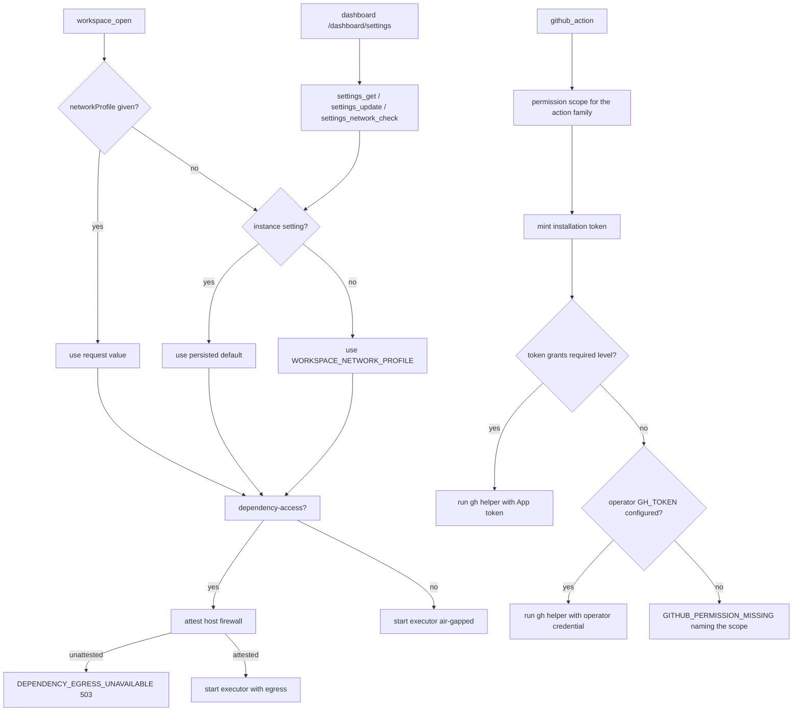

## Outcome

Opening a workspace now yields GitHub-capable network egress by default, the operator can change that default from a new dashboard Settings page without redeploying, and brokered GitHub writes no longer fail with an unexplained `403 Resource not accessible by integration`.

## Reported failures

| Symptom | Cause |
|---|---|
| `networkMode was replaced by networkProfile; choose 'network-none' or 'dependency-access'` | The retired `networkMode` field was still advertised — declared in the public `workspace_open` schema, listed in the generated tool reference, and present in the dashboard's open-workspace markup — so callers kept sending it. |
| `403 Resource not accessible by integration` on `issue_create` | `github_action` minted a GitHub App installation token with a single permission scope and never inspected the permissions GitHub granted it. A token short of `issues: write` was used as-is, and the working operator `GH_TOKEN` credential was only consulted when minting *threw*. |

## How It Works

- **Egress default.** `workspace_open` resolves `networkProfile` as: explicit request → instance-wide setting persisted in the runner state database → `WORKSPACE_NETWORK_PROFILE` (shipped default is now `dependency-access`). `dependency-access` permits public DNS and TCP 80/443 so the GitHub API and the bundled `gh` CLI work; it is attested before every executor start and fails closed with `DEPENDENCY_EGRESS_UNAVAILABLE` when the host firewall is not provisioned — never silently downgraded.
- **Operator control.** `/dashboard/settings` reads and writes the instance default through dashboard-only internal runner operations, with an on-demand egress readiness check and a visible warning that repository-controlled code can exfiltrate any credential injected into an egress workspace.
- **GitHub writes.** Each action family declares the permission scope it needs (`issues` for issue and label actions, `pull_requests` for pull-request actions; GitHub accepts either scope for the comment and label endpoints), the minted token's granted permissions are read back from GitHub, and the operator credential is used when the installation cannot satisfy the action. When nothing can, the failure is `GITHUB_PERMISSION_MISSING` naming the missing permission and both remedies.
- **Truthful capability.** `workspace_capabilities` reports `issuesRead`/`issuesWrite`/`pullRequestsRead`/`pullRequestsWrite` from the levels the verified installation actually grants, and adds `capabilities.workspace.defaultNetworkProfile`.

## Architecture / Flow

## Advisor Scope Lock

- Non-goals: no workspace-wide network allowlist or DLP boundary; no change to subagent isolation (subagents still require a `network-none` workspace); no per-principal network posture (the default is an instance policy); no wiring of the dashboard's existing dead open-workspace dialog.
- Locked decisions: persisted instance-wide default; dashboard-only internal operations, not public MCP tools; fail closed when egress is unattested; credential selection verified before execution; no retry after a `403`.

## Implementation metadata

- Branch: `mrgoonie/fix-github-permissions`
- Plan: `plans/260914-1439-workspace-network-default-settings/plan.md`
- Route: feature (`/ak:cook --tdd`)
- Mode: stable
- PR: TBD

## Acceptance Criteria

- [ ] `workspace_open` without `networkProfile` starts an executor on `dependency-access`, and the effective default is reported by `workspace_capabilities` and the dashboard.
- [ ] The operator can set `network-none`, `dependency-access`, or reset to the runner default from `/dashboard/settings`, and the choice survives a runner restart.
- [ ] `dependency-access` stays attested before every executor start; readiness is checkable from Settings; failure is `DEPENDENCY_EGRESS_UNAVAILABLE` with remediation and never a silent downgrade.
- [ ] `agent_spawn` in an egress workspace returns a conflict that names the `networkProfile: "network-none"` remediation.
- [ ] `github_action` uses the operator credential when the App installation cannot write, and otherwise returns `GITHUB_PERMISSION_MISSING` naming the missing scope and the fallback option.
- [ ] `workspace_capabilities` reports issue and pull-request access from granted installation permissions.
- [ ] No generated reference, MCP tool schema, or dashboard markup presents `networkMode` as usable.
- [ ] Lint, typecheck, unit tests, plugin check, and docs check pass.

## Pipeline State

- [x] Worktree and branch
- [x] Investigation (reconnaissance, root-cause evidence, advisory counsel)
- [x] Plan created, validated, red-teamed
- [ ] Implementation
- [ ] Local code review
- [ ] Testing
- [ ] Documentation
- [ ] PR shipped
- [ ] PR reviewed and replied
- [ ] Merge and CI convergence
